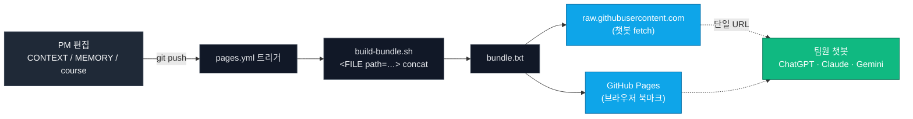

# sds-pm

서비스데이터사이언스 팀 프로젝트의 팀원 공유 목적의 하네스 저장소.

## 뭐가 편해지는가

- **새 AI 대화 열 때마다 프로젝트 설명을 다시 할 필요가 없다.** `CONTEXT.md + MEMORY.md + course/`를 한 번 붙여넣으면 이후 바로 본론.
- **카톡 공지는 PM이 AI로 초안을 만들어 올린다.** 톤이 일관되고, 팀원은 확인만 하면 된다.
- **과제 초안이 수업 프레임워크에 매핑된 상태로 나온다.** Product Goal·수업 Step·V1 중심·구체 수치가 자동 반영된다.
- **지난 과제 피드백이 이번 과제에 자동으로 반영된다.** `MEMORY.md`에 쌓인 교훈이 새 초안 작성 시 로드된다.
- **팀 결정이 한 곳에 기록되어 헷갈릴 일이 없다.** "30초였나 60초였나", "왜 그렇게 정했지" 전부 `CONTEXT.md §5`에서 바로 확인.
- **Claude Code 없어도 된다.** 쓰던 챗봇(ChatGPT, Claude 웹, Gemini) 그대로 써도 동일하게 작동한다.

## 사용법

### 챗봇 사용자 (ChatGPT, Claude 웹, Gemini 등)

새 대화 맨 처음에 아래 블록을 붙인다. 이게 끝이다.

```
아래 URL을 읽고 서데사 팀 AI PM으로 행동하라.
https://raw.githubusercontent.com/xhae123/sds-pm/main/bundle.txt
```

이후 질문하거나 과제 PDF를 첨부한다. 번들은 PM이 `git push`할 때마다 GitHub Actions가 자동으로 재빌드하므로 URL은 항상 최신을 가리킨다.

챗봇이 fetch를 실패하면 브라우저로 위 URL을 열어 전체 복사한 뒤 대화창에 붙여넣는다. 결과는 동일하다.

브라우저 북마크용 짧은 URL: <https://xhae123.github.io/sds-pm/>

### Claude Code 사용자

```bash
git clone https://github.com/xhae123/sds-pm.git
cd sds-pm
claude
```

자동 로드되는 슬래시 명령:

- `/run-assignment <PDF 경로>` — 과제 초안을 draft → review → final 3단계로 생성
- `/update-context <정보>` — 새 정보를 기존 문서와 비교·점검 후 반영 제안
- `/kakao-team` — 서데사 단톡 초안 작성 및 PM 승인 후 발송


## 업데이트

PM이 주기적으로 push한다. 팀원은 `git pull`로 동기화한다. 새 정보가 생기면 PM에게 공유하면 `/update-context`가 기존 내용과의 충돌·중복·근거 정합성을 점검한 뒤 반영 계획을 제시한다.

---

## 동작 원리

번들은 수동 관리하지 않는다. GitHub Actions가 아래 흐름을 자동화한다.



팀원은 새 챗봇 대화를 열 때마다 이 URL 하나를 던진다. 그 순간의 최신 팀 맥락이 AI 컨텍스트 윈도우로 그대로 들어간다. 레포의 모든 갱신이 별도 조치 없이 전 팀원의 AI에 반영된다. push부터 서빙까지 약 15초.
